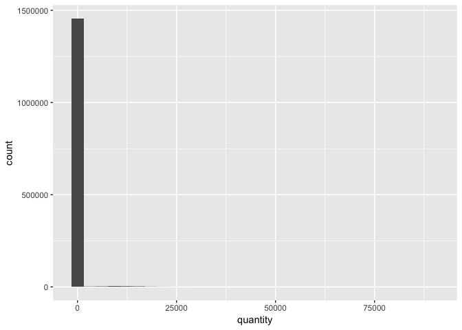
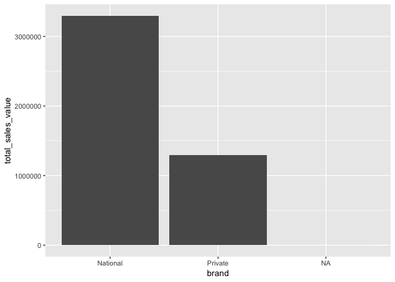
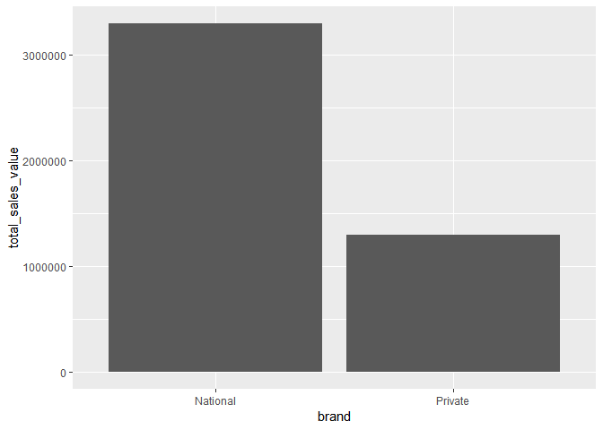
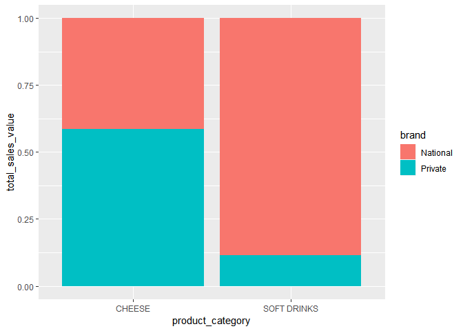

Data Visualization Solutions
================

The following questions are based on concepts covered in [Chapter 3](http://r4ds.had.co.nz/data-visualisation.html) of R4DS, and answers to them lie in the `transactions` and `products` datasets of the completejourney package. Load the tidyverse, completejourney, and lubridate packages to start working on them.

``` r
library(tidyverse)
library(completejourney)
library(lubridate) # see chapter 16 of r4ds
```

------------------------------------------------------------------------

**Question 1**: Create a histogram of `quantity`. What, if anything, do you find unusual about this visualization?

We designed this question to strengthen your ability to use `geom_histogram()`.

``` r
ggplot(data = transactions) + 
  geom_histogram(mapping = aes(x = quantity))
```



``` r
# The unusual aspect of the histogram is its extremely long tail. The distance
# is so far that the histogram almost appears to be a single bar. This
# distortion warrants additional steps (e.g., `filter(quantity <= 10)`).
```

------------------------------------------------------------------------

**Question 2**: Use a line graph to plot total sales value by day of the year. What, if anything, do you find unusual about this visualization?

We designed this question to strengthen your ability to use dplyr verbs in combination with `geom_line()`.

**Hint**: Get the day of the year from the `transaction_timestamp` variable in the `transactions` dataset with the [`yday()`](https://r4ds.had.co.nz/dates-and-times.html#date-time-components) function of the lubridate package.

``` r
transactions %>% 
  mutate(day_of_the_year = yday(transaction_timestamp)) %>% 
  group_by(day_of_the_year) %>% 
  summarize(total_sales_value = sum(sales_value, na.rm = TRUE)) %>%
  ggplot() + 
  geom_line(mapping = aes(x = day_of_the_year, y = total_sales_value))
```


``` r
# The most extreme days of the year are day numbers 327 and 357, which translate
# to November 23 and December 23, respectively. Sales on November 23 were likely
# very low due to it being Black Friday, and sales on December 23 were likely
# very high due to it being Christmas Eve.
```

------------------------------------------------------------------------

**Question 3**: Use a bar graph to compare the total sales value of national brands with that of private-label brands using the `brand` variable in the `products` dataset.

**Hint**: Because `transactions` does not contain product metadata, run the code below to create a new dataset with additional product information in it. Then, use `transactions_products` for your answer.

``` r
transactions_products <- left_join(transactions, products, by = 'product_id')
```

We designed this question to strengthen your ability to use dplyr verbs in combination with `geom_bar()` and its `stat` argument (see [here](https://r4ds.had.co.nz/data-visualisation.html#statistical-transformations)).

``` r
transactions_products %>%
  group_by(brand) %>%
  summarize(total_sales_value = sum(sales_value)) %>%
  ggplot() + 
  geom_bar(
    mapping = aes(x = brand, y = total_sales_value), 
    stat = "identity"
  )
```



------------------------------------------------------------------------

**Question 4**: Building on Question 3, suppose you want to understand whether the retailer's customers' preference for national brands (compared to private-label brands) is stronger in the soft drink category than it is in the cheese category. Examine this supposition by using a stacked bar graph to compare the split between national and private-label brands for soft drinks and cheeses.

**Hint**: Follow these three steps to create your plot:

-   Filter `transactions_products` to include only transactions with `product_category` equal to "SOFT DRINKS" or "CHEESE"
-   Calculate total sales value by `product_category` and `brand`
-   Create the bars using `geom_bar()` with `stat = 'identity'` and `position =  'fill'`

``` r
transactions_products %>%
  filter(product_category %in% c("SOFT DRINKS", "CHEESE")) %>%
  group_by(product_category, brand) %>%
  summarize(total_sales_value = sum(sales_value)) %>%
  ggplot() + 
  geom_bar(
    mapping  = aes(x = product_category, y = total_sales_value, fill = brand), 
    stat     = "identity", 
    position = "fill"
  )
```



------------------------------------------------------------------------

**Question 5**: Filter `transactions_products` for transactions in the peanut better, jelly, and jams product category (i.e., `"PNT BTR/JELLY/JAMS"`). Then, create a bar graph to visualize the distribution of the retailer's PB&J transactions by package size. Which two package sizes are the most popular?

``` r
transactions_products %>% 
  filter(product_category == "PNT BTR/JELLY/JAMS") %>% 
  group_by(package_size) %>% 
  summarize(count = n()) %>% 
  ggplot() + 
  geom_bar(
    mapping = aes(x = package_size %>% fct_reorder(count), y = count), 
    stat    = "identity"
  ) +
  coord_flip()
```



``` r
# The most popular package size for PB&J products is 18 oz. The runner-up is 32
# oz.
```
