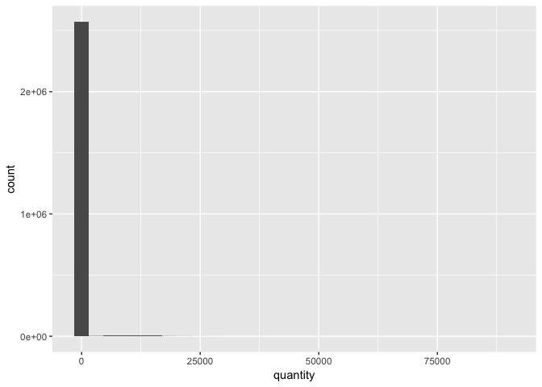
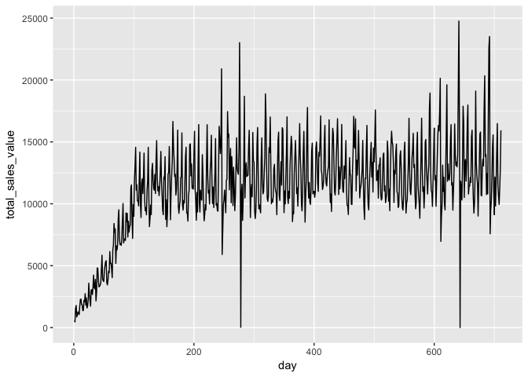
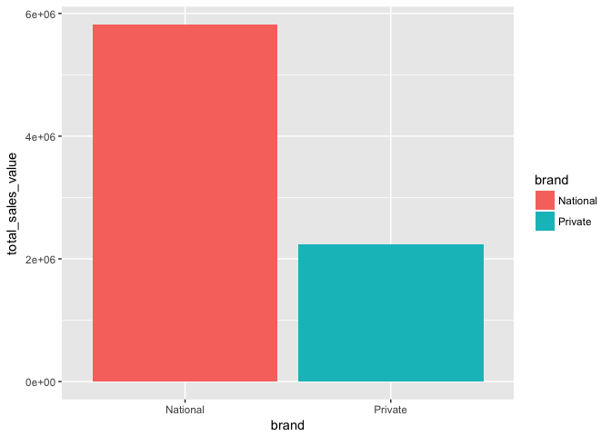
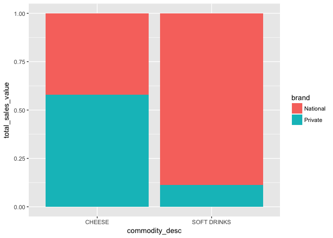
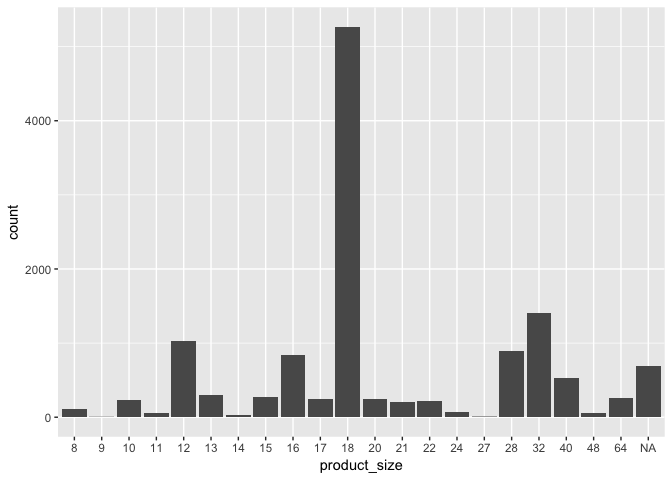

Data Visualization Solutions
================

The following 5 questions are based on concepts covered in Chapters 1-3 in R4DS and can be answered using The Complete Journey data. Start by loading the `tidyverse` and the `completejourney` package.

``` r
# required packages
library(tidyverse)
library(completejourney)
```

------------------------------------------------------------------------

**Question 1**: Create a histogram of quantity. Is there anything unusual in the graph?
*This question grows your ability to use `geom_histogram()`.*

**Answer**: The unusual part of the plot is an extremely long tail end to the histogram. The distance is so far that the histogram appears to look like a single bar. This may warrant further research and cleaning of the data.

``` r
ggplot(transaction_data) + 
  geom_histogram(mapping = aes(quantity))
```



------------------------------------------------------------------------

**Question 2**: Create a line chart that plots total sales value over time. Is there anything unusual in the graph?
*This question grows your ability to use `geom_line()`.*

**Answer**: The unusual part of the plot is the increase in total spend over the first 100 days and that some days had $0 in spend. It is possible that there are some issues with the data.

``` r
transaction_data %>% 
  group_by(day) %>% 
  summarize(total_sales_value = sum(sales_value, na.rm=TRUE)) %>%
  ggplot() + 
  geom_line(mapping = aes(x=day, y=total_sales_value))
```



------------------------------------------------------------------------

**Question 3**: Create a bar chart comparing total sales value of private label versus national brands. Assign different colors to the bars using the `fill` argument inside `aes()`. The `transaction_data` does not contain detailed product information, so first run the code below to create a new set of transactions with product data included and use `my_transaction_data` to answer the question.

``` r
my_transaction_data <- left_join(transaction_data, product, by='product_id')
```

*This question grows your ability to use `geom_bar()` along with its `stat` argument.*

**Answer**:

``` r
my_transaction_data %>%
  group_by(brand) %>%
  summarize(total_sales_value = sum(sales_value)) %>%
  ggplot() + 
  geom_bar(mapping = aes(x=brand, y=total_sales_value, fill=brand), stat='identity')
```



------------------------------------------------------------------------

**Question 4**: Building upon Question 3, we suspect customers prefer national brands for soft drinks, but less so for diary products like cheese. Confirm this by creating a stacked bar chart showing the percentage split of cheese sales between national and private brands and a similar split for soft drinks.

Hint: Follow these steps to create your plot:

-   Use `my_transaction_data` to filter to only transactions with `commodity_desc` equal to "SOFT DRINKS" or "CHEESE"
-   Calculate the total sales value by `commodity_desc` and `brand`
-   Create the bars using `geom_bar` with `stat='identity'` and `position='fill'`

**Answer**:

``` r
my_transaction_data %>%
  filter(commodity_desc %in% c('SOFT DRINKS', 'CHEESE')) %>%
  group_by(commodity_desc, brand) %>%
  summarize(total_sales_value = sum(sales_value)) %>%
  ggplot() + 
  geom_bar(mapping = aes(x=commodity_desc, y=total_sales_value, fill=brand), 
           stat='identity', position='fill')
```



------------------------------------------------------------------------

**Question 5**: Below is a block of code that creates a dataset of transactions of peanut better, jelly and jams with the product size determined in ounces. Run the code below to create the `pb_and_j_data` dataset and from it create a bar chart that shows the most popular size (in ounces) of peanut butter and jelly products.

``` r
pb_and_j_data <- my_transaction_data %>% 
  filter(commodity_desc == 'PNT BTR/JELLY/JAMS') %>%
  select(curr_size_of_product) %>%
  mutate(product_size = as.factor(as.integer(gsub('([0-9]+)([[:space:]]*OZ)',
                                                  '\\1', curr_size_of_product))))
```

**Answer**: The most popular PB&J product size is the 18oz jar. The runner-up is the 32oz jar.

``` r
ggplot(pb_and_j_data) + 
  geom_bar(aes(x=product_size))
```



This can be confirmed numerically from the data:

``` r
pb_and_j_data %>% 
  count(product_size) %>% 
  arrange(-n)
```

    ## # A tibble: 22 x 2
    ##    product_size     n
    ##    <fct>        <int>
    ##  1 18            5267
    ##  2 32            1403
    ##  3 12            1033
    ##  4 28             890
    ##  5 16             842
    ##  6 <NA>           694
    ##  7 40             525
    ##  8 13             301
    ##  9 15             275
    ## 10 64             259
    ## # ... with 12 more rows
