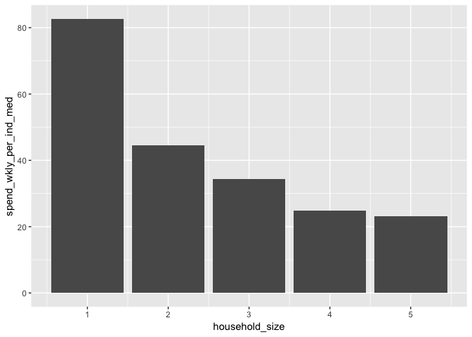
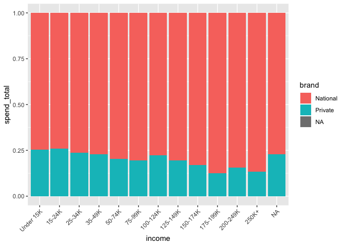

Exploratory Data Analysis (EDA) Solutions
================

The following questions are based on concepts covered in
[Chapter 7](http://r4ds.had.co.nz/exploratory-data-analysis.html) of
R4DS, and answers to them lie in the `transactions`, `demographics`, and
`products` datasets of the completejourney package. Load the tidyverse
and completejourney packages to start working on them.

``` r
library(tidyverse)
library(completejourney)
```

With these packages loaded, begin by creating `transactions_prices`.

``` r
transactions %>% 
  filter(quantity != 0) %>%
  mutate(
     price_regular  = (sales_value + retail_disc + coupon_match_disc) /
                       quantity,
     price_loyalty  = (sales_value + coupon_match_disc) / 
                       quantity,
     price_coupon   = (sales_value - coupon_disc) / 
                       quantity,
     price_purchase = case_when(
                            coupon_disc > 0 ~ price_coupon, 
                            retail_disc > 0 ~ price_loyalty,
                            TRUE            ~ price_regular
       )
  ) -> 
  transactions_prices
```

-----

**Question 1**: Determine median weekly spend per individual (not
household) using `price_purchase` in`transactions_prices` and
`household_size` in `demographics`.

Because `transactions_prices` does not contain household metadata, you
need to create a new dataset with household information in it. In
addition, because `household_size` is a factor variable, you need to
convert it to an integer variable to calculate weekly spend per
individual. Consider using the code below for the beginning of the pipe
you build for this question.

``` r
transactions_prices %>%
  inner_join(demographics, by = "household_id") %>% 
  mutate(
    household_size = str_replace(household_size, "5\\+", "5") %>% 
                     as.integer()
  )
```

``` r
transactions_prices %>%
  inner_join(demographics, by = "household_id") %>% 
  mutate(
    household_size     = str_replace(household_size, "5\\+", "5") %>% 
                         as.integer()
  ) %>% 
  group_by(household_id, week) %>%
  mutate(
    spend_total        = sum(price_purchase, na.rm = TRUE),
    spend_wkly_per_ind = spend_total / household_size
  ) %>% 
  ungroup() %>% 
  summarize(
    spend_wkly_per_ind_med = median(spend_wkly_per_ind, na.rm = TRUE)
  )
```

    ## # A tibble: 1 x 1
    ##   spend_wkly_per_ind_med
    ##                    <dbl>
    ## 1                   44.2

``` r
# Median weekly spend is $44.20.
```

-----

**Question 2**: As Hadley and Garrett outline in
[Chapter 7](http://r4ds.had.co.nz/exploratory-data-analysis.html), EDA
is an iterative cycle. Suppose that based on what you learned in
Question 1, you want to know what the median spend per individual is for
different household sizes. How could you plot median spend per
individual by household size to answer this new question with a
visualization?

``` r
transactions_prices %>%
  inner_join(demographics, by = "household_id") %>% 
  mutate(
    household_size     = str_replace(household_size, "5\\+", "5") %>% 
                         as.integer()
  ) %>% 
  group_by(household_id, week) %>%
  mutate(
    spend_total        = sum(price_purchase, na.rm = TRUE),
    spend_wkly_per_ind = spend_total / household_size
  ) %>% 
  group_by(household_size) %>% 
  summarize(
    spend_wkly_per_ind_med = median(spend_wkly_per_ind, na.rm = TRUE)
  ) %>% 
  ggplot(aes(x = household_size, y = spend_wkly_per_ind_med)) +
  geom_col()
```

<!-- -->

-----

**Question 3**: Are baskets with diapers in them more likely than
average to have beer in them, too? Legend has it that placing these two
product categories closer together can increase beer sales
([Powers 2002](https://www.theregister.co.uk/2006/08/15/beer_diapers/)).
Using the following starter code, calculate
[lift](https://en.wikipedia.org/wiki/Lift_\(data_mining\)) for the
“association rule” that diapers in a basket (i.e., `product_type ==
"BABY DIAPERS"`) imply that beer is in the basket (i.e., `product_type
== "BEERALEMALT LIQUORS"`). Does the association between these products
offer support for the legend?

``` r
transactions_prices %>% 
  inner_join(products, by = "product_id") %>% 
  mutate(
    diapers = product_type == "BABY DIAPERS", 
    beer    = product_type == "BEERALEMALT LIQUORS"
  )
```

``` r
transactions_prices %>% 
  inner_join(products, by = "product_id") %>% 
  mutate(
    diapers = product_type == "BABY DIAPERS", 
    beer    = product_type == "BEERALEMALT LIQUORS"
  ) %>% 
  group_by(basket_id) %>%
  summarize(
    basket_has_diapers = max(diapers), 
    basket_has_beer    = max(beer)
  ) %>% 
  summarize(
      prop_both   = sum(basket_has_diapers * basket_has_beer == 1, na.rm = TRUE) 
                    / sum(basket_has_diapers == 1, na.rm = TRUE),
      prob_beer   = mean(basket_has_beer, na.rm = TRUE),
      diaper_lift = prop_both / prob_beer
   )
```

    ## # A tibble: 1 x 3
    ##   prop_both prob_beer diaper_lift
    ##       <dbl>     <dbl>       <dbl>
    ## 1    0.0552    0.0554       0.996

``` r
# the complete journey data do not bear out the parable of beer and diapers, as
# the lift of 1 suggests that the probability of a customer having diapers in a
# basket and that of them having beer in a basket are independent of each other.
```

-----

**Question 4**: Using a stacked bar chart that is partitioned by income
level (i.e., `income`), visualize the total amount of money that
households in the Complete Journey Study spent on national-brand
products versus private-label products (i.e., `brand`).

Because `transactions_prices` does not contain household or product
metadata, you need to create a new dataset with this information in it.
Consider using the code below for the beginning of the pipe you build
for this question.

``` r
transactions_prices %>% 
  left_join(demographics, by = "household_id") %>% 
  left_join(products, by = "product_id")
```

``` r
transactions_prices %>% 
  left_join(demographics, by = "household_id") %>% 
  left_join(products, by = "product_id") %>% 
  group_by(income, brand) %>%
  summarize(spend_total = sum(price_purchase)) %>% 
  ggplot(mapping = aes(x = income, y = spend_total, fill = brand)) +
  geom_col(position = "fill") + 
  theme(axis.text.x = element_text(angle = 45, hjust = 1))
```

<!-- -->
