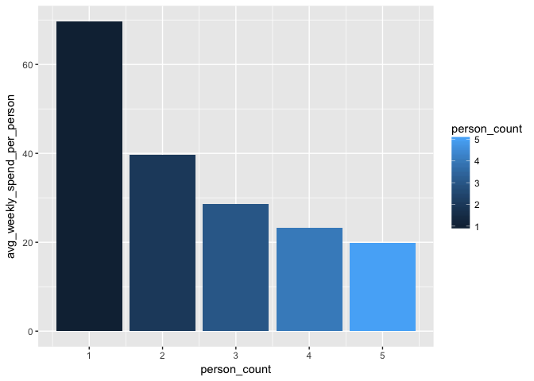
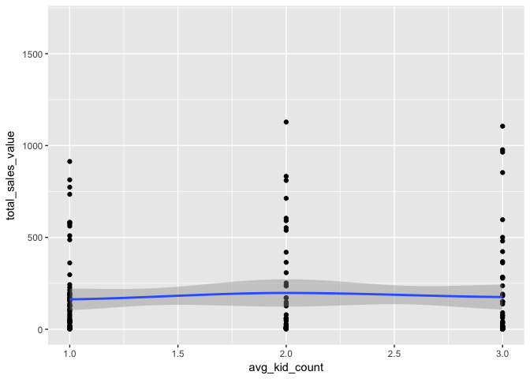
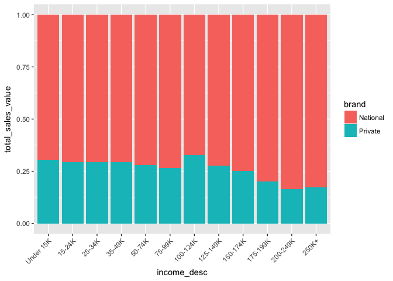

Exploratory Data Analysis (EDA) Solutions
================

The following 7 questions are based on concepts covered in Chapters 7-8 in R4DS and can be answered using The Complete Journey data. Start by loading the `tidyverse` and the `completejourney` package.

``` r
# required packages
library(tidyverse)
library(completejourney)
```

Run the following block of code to join datasets together and use when answering questions.

``` r
my_transaction_data <- left_join(transaction_data, 
                                 product, by='product_id')
my_transaction_data <- left_join(my_transaction_data, 
                                 hh_demographic, by='household_key')
my_campaign_table <- left_join(campaign_table,
                               campaign_desc, by=c('campaign','description'))
```

------------------------------------------------------------------------

**Question 1**: How many unique households exist in `my_transaction_data`? Also, how many of those households have demographic data in `hh_demographic`?

Here are some suggested steps:

1.  Create a list of unique `household_key`s from `my_transaction_data` using `distinct()`
2.  Count of households using `nrow()`
3.  Use the `inner_join()` function to merge with `hh_demographic`
4.  Count the remaining rows in your result

*This question grows your ability to count unique records in a dataset using `distinct()` and then use [`inner_join()`](http://r4ds.had.co.nz/relational-data.html#inner-join) to count records that existence in both datasets.*

**Answer**: There are 2,500 households in the dataset, of which 801 have demographic data. This is an important finding when working with this data in other ways because anytime we do analysis of transactions by demographic, we'll need to filter out the `NA` values from transactions made by the remaining 1,699 households who do not have reported demographic data.

``` r
unique_households <- my_transaction_data %>% 
  distinct(household_key)
unique_households %>% nrow()
```

    ## [1] 2500

``` r
inner_join(unique_households, hh_demographic, by='household_key') %>%
  nrow()
```

    ## [1] 801

------------------------------------------------------------------------

**Question 2**: Determine the weekly average spend per person. Hint: Calculate total weekly sales value per household and divide by the number of people. Below is the code to convert `household_size_desc` into an integer. Remember, we only have household demographics for a select portion of the data, so your first step should be to filter to only transactions that have a non-missing value in `household_size_desc`.

`mutate(hh_person_count = as.integer(gsub('\\+' ,'', household_size_desc)))`

*This question grows your ability to create a pipeline of data transformation steps to generate results. Specific functions include: [`filter()`](http://r4ds.had.co.nz/transform.html#filter-rows-with-filter), [`mutate()`](http://r4ds.had.co.nz/transform.html#add-new-variables-with-mutate), [`group_by()`, `summarize()`, and `ungroup()`](http://r4ds.had.co.nz/transform.html#grouped-summaries-with-summarise).*

**Answer**: The weekly average spend per person is ~$45.30

``` r
weekly_spend_per_person <- my_transaction_data %>%
  filter(!is.na(household_size_desc)) %>%
  mutate(hh_person_count = as.integer(gsub('\\+' ,'', household_size_desc))) %>%
  group_by(household_key, week_no) %>%
  summarize(person_count = max(hh_person_count, na.rm=TRUE), 
            total_sales_value = sum(sales_value, na.rm=TRUE)) %>%
  ungroup() %>% 
  mutate(weekly_spend_per_person = total_sales_value / person_count)

weekly_spend_per_person %>%
  summarize(avg_wkly_spend_per_person = mean(weekly_spend_per_person, na.rm=TRUE))
```

    ## # A tibble: 1 x 1
    ##   avg_wkly_spend_per_person
    ##                       <dbl>
    ## 1                      45.3

------------------------------------------------------------------------

**Question 3**: Using the data derived in Question 2, plot the average spend per person segmented by count of children.
*This question grows your ability to [`group_by()` and `summarize()`](http://r4ds.had.co.nz/transform.html#grouped-summaries-with-summarise) and then plot the result using `geom_bar()`.*

**Answer**: It appears that the average spend per person decreases as the household size increases. This might be because we're dividing by a larger number, but some other explanations might include: Larger households have economies of scale from buying in bulk or larger households might have a smaller budget per person.

``` r
weekly_spend_per_person %>% 
  group_by(person_count) %>% 
  summarize(avg_weekly_spend_per_person = mean(weekly_spend_per_person, na.rm=TRUE)) %>%
  ggplot() + 
  geom_bar(mapping=aes(x=person_count, 
                       y=avg_weekly_spend_per_person, 
                       fill=person_count), stat='identity')
```



------------------------------------------------------------------------

**Question 4**: Correlate spend on baby products with count of children. You can gauge the relationship visually by creating a scatterplot of the two variables and adding a trend line. Hint: This question requires transforming `kid_category_desc` similar to Question 2 when we transformed `household_size_desc` into an integer.

Here are some suggested steps:

1.  Filter out baby product transactions and non-missing household information on children using this code: `filter(!is.na(kid_category_desc), grepl('BABY', sub_commodity_desc))`
2.  Create a variable of the number of children in a household using this code:
    `mutate(hh_kid_count = as.integer(gsub('\\+' ,'', kid_category_desc)))`
3.  Summarize the total spend per child across households
4.  Create a scatterplot with line using `geom_point()` and `geom_smooth()`.

*This question grows your ability to [`filter()`](http://r4ds.had.co.nz/transform.html#filter-rows-with-filter), [`mutate()`](http://r4ds.had.co.nz/transform.html#add-new-variables-with-mutate), [`group_by()`, and `summarize()`](http://r4ds.had.co.nz/transform.html#grouped-summaries-with-summarise) and then plot the result using `geom_point()` and `geom_smooth()`.*

**Answer**: There does not appear to be a strong relationship between total spend on baby products and the number of children in the household. Some explanations might include: Households with more children buy baby products in other stores or that the children are old enough to no longer require baby products.

``` r
 my_transaction_data %>%
  filter(!is.na(kid_category_desc), grepl('BABY', sub_commodity_desc)) %>%
  mutate(hh_kid_count = as.integer(gsub('\\+' ,'', kid_category_desc))) %>%
  group_by(household_key) %>%
  summarize(avg_kid_count = mean(hh_kid_count, na.rm=TRUE), 
            total_sales_value = sum(sales_value, na.rm=TRUE)) %>% 
  ggplot(data=., mapping=aes(x=avg_kid_count, y=total_sales_value)) + 
  geom_point() + 
  geom_smooth()
```



------------------------------------------------------------------------

**Question 5**: In data analysis folklore it is said that Walmart increased beer sales by positioning diapers closer to the beer. What percentage of shopping baskets contained both diapers and beer? Hint: The `sub_commodity_desc` value for diapers is "BABY DIAPERS" and for beer it's "BEERALEMALT LIQUORS".

**Answer:** Roughly 0.1% of baskets contained both diapers and beer. Only about 1.65% of baskets contained diapers and 5.67% contained beer. This may seem small, but you can calculate "lift" as the improved likelihood of buying both compared to the frequency of buying just one or the other. In this case the lift is 1.07, or 7%, indicating a 7% increase in sales of beer when buying diapers!

``` r
my_transaction_data %>%
  select(basket_id, sub_commodity_desc) %>%
  filter(!is.na(sub_commodity_desc)) %>%
  mutate(diapers_indicator = (sub_commodity_desc == 'BABY DIAPERS'), 
         beer_indicator = (sub_commodity_desc == 'BEERALEMALT LIQUORS')) %>%
  group_by(basket_id) %>%
  summarize(basket_diapers_indicator = any(diapers_indicator), 
            basket_beer_indicator = any(beer_indicator)) %>%
  mutate(diapers_and_beer = basket_diapers_indicator * basket_beer_indicator) %>%
  ungroup() %>%
  summarize(diapers_and_beer_pct_of_total = mean(diapers_and_beer))
```

    ## # A tibble: 1 x 1
    ##   diapers_and_beer_pct_of_total
    ##                           <dbl>
    ## 1                       0.00100

``` r
# calculating association rule lift
# frequency of diapers and beer, relative to diapers and beer independently
0.001002984 / (0.01654018 * 0.05666314)
```

    ## [1] 1.070171

------------------------------------------------------------------------

**Question 6**: Create a stacked bar chart showing across household income levels the percentage of sales from national brand products versus private label products. Describe the trend about the proportion of private label sales made across income levels.

**Answer**: Roughly 30% of sales are private label products and this is stable across most income levels up until the $150-174K income level. At this point the sale of private lable products declines.

``` r
brand_stats <- my_transaction_data %>% 
  filter(!is.na(income_desc), !is.na(brand)) %>%
  mutate(income_desc = factor(income_desc, 
                                 levels=c("Under 15K", "15-24K", "25-34K", "35-49K", 
                                          "50-74K", "75-99K", "100-124K", "125-149K", 
                                          "150-174K", "175-199K", "200-249K", "250K+"), 
                                 ordered=TRUE)) %>%
  group_by(income_desc, brand) %>%
  summarize(total_sales_value = sum(sales_value))
```

``` r
# visually
ggplot(brand_stats) + 
  geom_bar(mapping = aes(x=income_desc, y=total_sales_value, fill=brand), 
           stat='identity', position='fill') + 
  theme(axis.text.x=element_text(angle=45, hjust=1))
```



``` r
# quantitatively
brand_stats %>% 
  group_by(income_desc) %>%
  mutate(pct_of_total = total_sales_value / sum(total_sales_value)) %>%
  select(income_desc, brand, pct_of_total) %>% 
  tail(12) %>%
  spread(brand, pct_of_total)
```

    ## # A tibble: 6 x 3
    ## # Groups:   income_desc [6]
    ##   income_desc National Private
    ## * <ord>          <dbl>   <dbl>
    ## 1 100-124K       0.673   0.327
    ## 2 125-149K       0.722   0.278
    ## 3 150-174K       0.749   0.251
    ## 4 175-199K       0.800   0.200
    ## 5 200-249K       0.836   0.164
    ## 6 250K+          0.828   0.172

------------------------------------------------------------------------

**Question 7**: How often do retailers match the manufacturer's coupons? Hint: Filter the data where `coupon_disc > 0` and find the percentage of these observations that `coupon_match_disc < 0` is also true.

**Answer**: Retailers provided a coupon matching discount 47.9% of the time that a coupon was used.

``` r
# visually
transaction_data %>%
  select(coupon_match_disc, coupon_disc) %>%
  filter(coupon_disc < 0) %>%
  summarize(coupon_match_rate = mean(coupon_match_disc < 0))
```

    ##   coupon_match_rate
    ## 1         0.4790786
