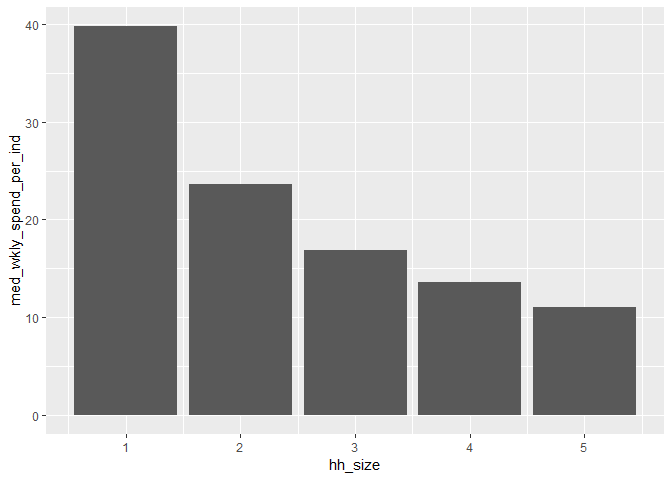
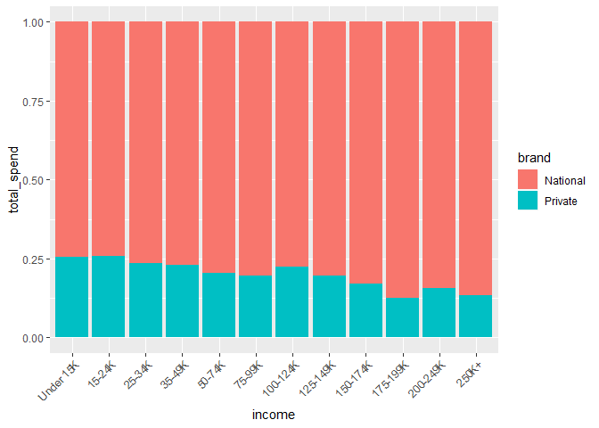

Exploratory Data Analysis (EDA) Solutions
================

The following questions are based on concepts covered in [Chapter 7](http://r4ds.had.co.nz/exploratory-data-analysis.html) of R4DS, and answers to them lie in the `transactions` and `products` datasets of the completejourney package. Load the tidyverse, completejourney, and lubridate packages to start working on them.

``` r
library(tidyverse)
library(completejourney)
```

After running the following code, use `my_transaction_data` to work on the following exercises.

``` r
left_join(transactions, products, by = "product_id") %>% 
   left_join(demographics, by = "household_id") %>%
   filter(quantity != 0) %>%
   mutate(
     regular_price  = (sales_value + retail_disc + coupon_match_disc) /
                       quantity,
     loyalty_price  = (sales_value + coupon_match_disc) / 
                       quantity,
     coupon_price   = (sales_value - coupon_disc) / 
                       quantity,
     purchase_price = ifelse(coupon_disc > 0, coupon_price, 
                             ifelse(retail_disc > 0, loyalty_price,
                                                             regular_price
       )
     )
   ) -> my_transaction_data
```

------------------------------------------------------------------------

**Question 1**: How many unique households exist in `my_transaction_data`, and how many of these households have demographic data in `demographics`?

1.  Use `distinct()` to create a tibble of unique `household_id` values.
2.  Use `nrow()` to count these households.
3.  Use `inner_join()` to match `my_transaction_data` with `demographics`.
4.  Use `distinct()` and `nrow()` to count the rows that remain.

``` r
my_transaction_data %>% 
  distinct(household_id) %>% 
  nrow()
```

    ## [1] 2469

``` r
inner_join(my_transaction_data, demographics, by = "household_id") %>% 
  distinct(household_id) %>% 
  nrow()
```

    ## [1] 801

``` r
# There are 2,469 unique households in my_transaction_data, 801 of which have
# data in demographics.
```

------------------------------------------------------------------------

**Question 2**: Determine median weekly spend per individual using the following tibble (i.e., `exercise_2`).

``` r
inner_join(my_transaction_data, demographics) %>% 
   mutate(
     hh_size          = str_replace(household_size, "5\\+", "5") %>% 
                         as.integer()
   ) %>% 
   group_by(household_id, week) %>% 
   summarize(
     total_spend      = sum(purchase_price, na.rm = TRUE),
     hh_size          = max(hh_size,        na.rm = TRUE)
   ) %>% 
   ungroup() %>%
  mutate(
    wkly_spend_per_ind = total_spend / hh_size
  ) -> exercise_2
```

``` r
exercise_2 %>% 
  summarize(
    med_wkly_spend_per_ind = median(wkly_spend_per_ind, na.rm = TRUE)
  )
```

    ## # A tibble: 1 x 1
    ##   med_wkly_spend_per_ind
    ##                    <dbl>
    ## 1                   23.8

``` r
# Median weekly spending is $23.80.
```

------------------------------------------------------------------------

**Question 3**: Building on Question 2, plot median spend per individual for the five household sizes in `my_transaction_data`.

``` r
exercise_2 %>% 
  group_by(hh_size) %>% 
  summarize(
    med_wkly_spend_per_ind = median(wkly_spend_per_ind, na.rm = TRUE)
  ) %>% 
  ggplot(aes(x = hh_size, y = med_wkly_spend_per_ind)) +
  geom_col()
```



------------------------------------------------------------------------

**Question 4**: Are baskets with diapers in them more likely than average to have beer in them too? Legend has it that placing these two product categories closer together can increase beer sales [(Powers 2002)](https://www.theregister.co.uk/2006/08/15/beer_diapers/). Using the following starter code, calculate [lift](https://en.wikipedia.org/wiki/Lift_(data_mining)) for the "association rule" that diapers in a basket (i.e., `product_type == "BABY DIAPERS"`) imply beer is in the basket (i.e., `product_type == "BEERALEMALT LIQUORS"`). Is the association between these products practically significant in `my_transaction_data`?

``` r
inner_join(my_transaction_data, products) %>% 
  mutate(
    diapers = product_type == "BABY DIAPERS", 
    beer    = product_type == "BEERALEMALT LIQUORS"
  )
```

``` r
inner_join(my_transaction_data, products) %>% 
  mutate(
    diapers = product_type == "BABY DIAPERS", 
    beer    = product_type == "BEERALEMALT LIQUORS"
  ) %>%
  group_by(basket_id) %>%
  summarize(
    basket_has_diapers = max(diapers), 
    basket_has_beer    = max(beer)
  ) %>% 
  summarize(
    prop_both   = sum(basket_has_diapers * basket_has_beer == 1) / 
                  sum(basket_has_diapers == 1),
    prob_beer   = mean(basket_has_beer),
    diaper_lift = prop_both / prob_beer
  )
```

    ## # A tibble: 1 x 3
    ##   prop_both prob_beer diaper_lift
    ##       <dbl>     <dbl>       <dbl>
    ## 1    0.0557    0.0554        1.01

------------------------------------------------------------------------

**Question 5**: Using a stacked bar chart that's partitioned by income level (i.e., `income`), visualize the total amount of money customers spent on national-brand products versus private-label products.

``` r
inner_join(my_transaction_data, demographics) %>% 
  mutate(
    income = factor(income, 
                         levels = c("Under 15K",   "15-24K",   "25-34K", 
                                       "35-49K",   "50-74K",   "75-99K", 
                                     "100-124K", "125-149K", "150-174K", 
                                     "175-199K", "200-249K",    "250K+"),
                         ordered = TRUE)
  ) %>%
  group_by(income, brand) %>%
  summarize(total_spend = sum(purchase_price)) %>% 
  ggplot() +
  geom_col(aes(x = income, y = total_spend, fill = brand), 
           position = "fill") + 
  theme(axis.text.x = element_text(angle = 45, hjust = 1))
```


