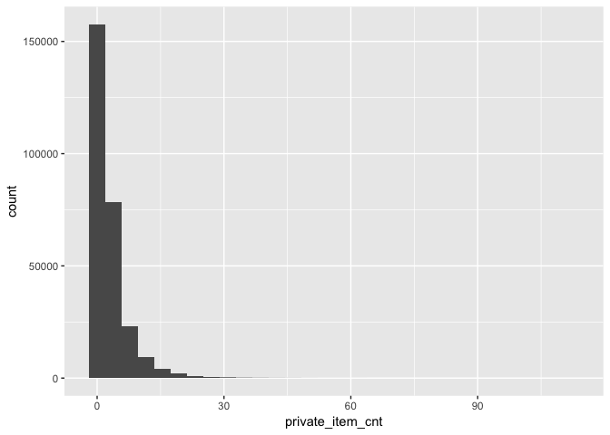
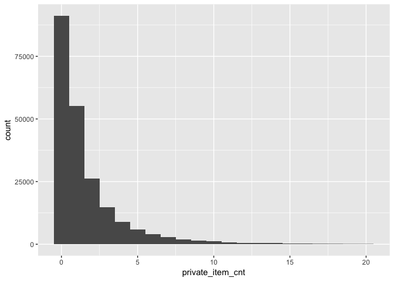

Brandefy Private Label Case Solutions
================

The following 7 questions are based on the Brandefy case study and can be answered using The Complete Journey data. The Complete Journey data is an ideal test bed for better understanding consumer behavior around national and private label brands as Meg Greenhalgh considers building a Brandefy app. There is a column entitled "brand" in the `product` dataset that shows for each product whether it is a "National" or "Private" brand. Start your analysis by loading the `tidyverse`, `scales`, `gridExtra`, and `completejourney` packages.

``` r
# required packages
library(tidyverse)
library(gridExtra)
library(scales)
library(completejourney)
```

------------------------------------------------------------------------

**Question 1**:
Meg Greenhalgh is trying to gauge the overall opportunity for usage of an app that shoppers could use in-store to scan items and see product reviews of similar private label products. Meg Greenhalgh thinks that shoppers are confronted with roughly 10 opportunities per trip to decide between a national or private-label brand. Using the Complete Journey dataset count the number of private label items per basket and plot the distribution as a histogram. This will help to start to get a sense for how many times consumers purchase a private label item per trip. Hint: When calculating the private label items per basket ensure you include the baskets with zero private label items. You can do this by summarizing the baskets using: `summarize(private_item_cnt = sum(brand == 'Private'))`.

**Answer**:
In the histogram it appears that the majority of baskets have a low number of private label items; however, it is a very long-tailed distribution. In order to better gauge a rough estimate from the plot we've provided a histogram ignoring baskets with greater than 30 private label items. The long tail is an interesting insight because Meg Greenhalgh may be able to sub-segment potential users of the app into casual buyers and die-hard private label fans that would purchase private label items in bulk.

``` r
private_item_cnt <- transaction_data %>%
  inner_join(product, by='product_id') %>%
  group_by(basket_id) %>%
  summarize(private_item_cnt = sum(brand == 'Private'))

plot1 <- ggplot(private_item_cnt) + 
  geom_histogram(aes(private_item_cnt), binwidth=3) + 
  xlab("Private Label Items in Basket") + 
  ylab("Count") + 
  scale_y_continuous(labels=comma) + 
  ggtitle(label = "Distribution of\nPrivate Label Items\nper Basket", 
          subtitle = "Considering Baskets\nof All Sizes") + 
  theme(plot.title=element_text(size=10, face="bold", hjust = 0.5), 
        plot.subtitle=element_text(size=8, hjust = 0.5))

# removing the baskets above 30 items
plot2 <- private_item_cnt %>% 
  filter(private_item_cnt <= 30) %>%
  ggplot() + 
  geom_histogram(aes(private_item_cnt), binwidth=3) + 
  xlab("Private Label Items in Basket") + 
  ylab("Count") + 
  scale_y_continuous(labels=comma) + 
  ggtitle(label = "Distribution of\nPrivate Label Items\nper Basket" , 
          subtitle = "Excluding Baskets with\nGreater than 30 Items") + 
  theme(plot.title=element_text(size=10, face="bold", hjust = 0.5), 
        plot.subtitle=element_text(size=8, hjust = 0.5))

grid.arrange(plot1, plot2, ncol=2)
```



------------------------------------------------------------------------

**Question 2**:
The answer to Question 1 is all well and good, but people might only use the Brandefy app the first time they purchase a private label product. Repeat the analysis of Question 1 only counting the first-time purchase of a private label product per household. Hint: Arrange the transactions by `day`, then add a counter using the`row_number()` function to determine the first instance that a `product_id` was purchased by a `household_key`.

**Answer**:
The average number of private label items per basket appears lower after deciding to only count the first time purchase of the item as the time when the app would be most likely used. If we used the data in Question 1 we might have been overstating the potential uses of the app.

``` r
private_item_cnt_deduped <- transaction_data %>%
  inner_join(product, by='product_id') %>%
  arrange(day) %>%
  group_by(household_key, product_id) %>%
  mutate(purchase_instance = row_number()) %>%
  ungroup() %>%
  group_by(basket_id) %>%
  summarize(private_item_cnt = sum(brand == 'Private' & 
                                     purchase_instance == 1))

private_item_cnt_deduped %>% 
  filter(private_item_cnt <= 20) %>%
  ggplot() + 
  geom_histogram(aes(private_item_cnt), binwidth=1) + 
  xlab("First Purchase Private Label Items in Basket") + 
  ylab("Count") + 
  scale_y_continuous(labels=comma) + 
  ggtitle(label = "Distribution of Private Label Items per Basket" , 
          subtitle = "Only Considers First-Time Purchase of the Item (<= 20 items/basket)") + 
  theme(plot.title=element_text(size=10, face="bold"), 
        plot.subtitle=element_text(size=8))
```



------------------------------------------------------------------------

**Question 3**: Meg Greenhalgh saw the histogram you created for Question 2 that only considers first time purchases help and was impressed, but would also like some hard numbers. Calculate the following summary statistics:

1.  The average number of private label products per basket
2.  The average sales value of these products per basket
3.  The percentage of baskets containing at least 1 product
4.  The percentage of baskets containing 0-2 products

**Answer**: The answers to the questions posed are:

1.  1.30 — the average number of private label products per basket
2.  $3.13 — the average sales value of these products per basket
3.  45.6% — the percentage of baskets containing at least 1 product
4.  83.8% — the percentage of baskets containing 0-2 products

``` r
private_items_flagged <- transaction_data %>%
  inner_join(product, by='product_id') %>%
  arrange(day) %>%
  group_by(household_key, product_id) %>%
  mutate(purchase_instance = row_number()) %>%
  ungroup() %>%
  mutate(first_purchased_pvt_product = (brand == 'Private' & 
                                          purchase_instance == 1))

private_items_flagged %>%
  group_by(basket_id) %>%
  summarize(private_item_cnt = sum(first_purchased_pvt_product), 
            private_item_value = sum(sales_value[first_purchased_pvt_product])) %>%
  ungroup() %>%
  summarize(avg_private_items = mean(private_item_cnt), 
            avg_pvt_items_value = mean(private_item_value),
            perct_at_least_one = mean(private_item_cnt >= 1),
            perct_lte_two = mean(private_item_cnt <= 2))
```

    ## # A tibble: 1 x 4
    ##   avg_private_items avg_pvt_items_value perct_at_least_one perct_lte_two
    ##               <dbl>               <dbl>              <dbl>         <dbl>
    ## 1              1.30                3.13              0.456         0.838

------------------------------------------------------------------------

**Question 4**:
Meg Greenhalgh and her team have a limited amount of time and resources to review private label products, so they shifted towards a review club with category captains. What categories should Brandefy prioritize as it expands? To help answer this question, let's first try to prioritize based on the ratio of private to national label products. Meg should have good product review coverage in categories that have a high ratio of private label purchases over national brands. Create a list of the top 10 product categories based on ratio of private label to national product purchases. Here are some suggested steps to analyze:

1.  Inner Join `transaction_data` with `product` datasets to obtain the `commodity_desc` per transaction
2.  Obtain a count of transactions by `commodity_desc` and `brand` using the `count()` function
3.  Use the `spread()` function to create two columns of counts side-by-side (Private and National)
4.  Calculate a private-to-national ratio by dividing the `Private` column by the `National` column
5.  Calculate a column called `total_cnt` so we can filter out any noise related to categories with only a handful of purchases.
6.  Filter the dataset to only the top 10 by private-to-national ratio categories with at least 1,000 total transactions
7.  Arrange the data in descending order by the private-to-national ratio

**Answer**:
Below is a list of the top 10 categories with frozen fruit, eggs, and milk topping the list. These products do not have strong brand loyalty, so shoppers are more likely to purchase the private label over the national brand.

``` r
transaction_data %>%
  inner_join(product, by='product_id') %>%
  count(commodity_desc, brand) %>%
  spread(brand, n) %>%
  mutate(total_cnt = Private + National, 
         private_ratio = Private / National) %>%
  filter(total_cnt > 1000, commodity_desc != 'COUPON/MISC ITEMS') %>%
  top_n(10, private_ratio) %>%
  arrange(desc(private_ratio))
```

    ## # A tibble: 10 x 5
    ##    commodity_desc      National Private total_cnt private_ratio
    ##    <chr>                  <int>   <int>     <int>         <dbl>
    ##  1 FRZN FRUITS               12    1400      1412        117.  
    ##  2 EGGS                    1958   26462     28420         13.5 
    ##  3 FLUID MILK PRODUCTS     8264   77366     85630          9.36
    ##  4 CHICKEN/POULTRY          887    5420      6307          6.11
    ##  5 CARROTS                 1312    7199      8511          5.49
    ##  6 OLIVES                   624    2303      2927          3.69
    ##  7 PAPER HOUSEWARES        2604    8072     10676          3.10
    ##  8 MILK BY-PRODUCTS        5780   17246     23026          2.98
    ##  9 COOKIES                 1415    3387      4802          2.39
    ## 10 SUGARS/SWEETNERS        3462    7925     11387          2.29

------------------------------------------------------------------------

**Question 5**:
Meg Greenhalgh would also like to consider prioritizing product categories based on the price gap between national brands and private label brands. Create a list of the top 10 product categories based on price difference of the private and national brand product. Here are some suggested steps to analyze:

1.  Find the count of national and private label transactions in each `commodity_desc`
2.  Filter this table to only include categories with at least 100 national and private label transactions. This can be used later to filter out and only look at price differences between categories which have a critical mass of transactions in both national and private label products.
3.  Inner Join `transaction_data` with `product` datasets to obtain the `commodity_desc` per transaction
4.  Inner Join the filtered counts data with the result from Step 3 by `commodity_desc` to filter down the categories we're considering
5.  Group by `commodity_desc` and `brand` and calculate the average `sales value`
6.  Use the `spread()` function to put the private and national average prices side-by-side and calculate the difference as `price_diff = Private - National`.
7.  Select the top 10 most negative prices using `top_n(-10, price_diff)`.

**Answer**: Infant formula, liquor, diapers, smoked meats, and laundry detergent top the list of products with the largest price difference between private label and national brands. It's not obvious to think of these product categories, but now that Meg Greenhalgh has this information, she can review the products and recommend them in her app as products having a really good value if the private label reviews well compared to the national label.

``` r
counts_data <- transaction_data %>%
  inner_join(product, by='product_id') %>%
  count(commodity_desc, brand) %>%
  spread(brand, n) %>%
  filter(Private > 100, National > 100)

transaction_data %>%
  inner_join(product, by='product_id') %>%
  inner_join(counts_data %>% 
               select(commodity_desc), by='commodity_desc') %>%
  group_by(commodity_desc, brand) %>%
  summarize(brand_cnt = length(brand), 
            avg_price = mean(sales_value, na.rm=TRUE)) %>%
  group_by(commodity_desc) %>%
  mutate(total_cnt = sum(brand_cnt)) %>%
  ungroup() %>%
  select(-brand_cnt) %>%
  spread(brand, avg_price) %>%
  mutate(price_diff = Private - National) %>%
  filter(is.finite(price_diff),
         commodity_desc != 'COUPON/MISC ITEMS') %>%
  top_n(-10, price_diff) %>%
  arrange(price_diff) %>%
  mutate(price_diff = dollar(price_diff))
```

    ## # A tibble: 10 x 5
    ##    commodity_desc            total_cnt National Private price_diff
    ##    <chr>                         <int>    <dbl>   <dbl> <chr>     
    ##  1 INFANT FORMULA                 2885    18.5     7.31 $-11.20   
    ##  2 LIQUOR                         2699     9.15    3.20 $-5.95    
    ##  3 DIAPERS & DISPOSABLES          5008    14.0     8.28 $-5.76    
    ##  4 SMOKED MEATS                   4095     6.84    2.52 $-4.32    
    ##  5 LAUNDRY DETERGENTS             8852     6.47    2.66 $-3.81    
    ##  6 FOOT CARE PRODUCTS              570     7.73    4.10 $-3.63    
    ##  7 FROZEN CHICKEN                  496    10.4     7.06 $-3.36    
    ##  8 EYE AND EAR CARE PRODUCTS      1217     6.96    3.61 $-3.34    
    ##  9 COOKWARE & BAKEWARE            1156     6.36    3.05 $-3.31    
    ## 10 SEAFOOD-FRESH                  4204     6.32    3.02 $-3.30

------------------------------------------------------------------------

**Question 6**:
Meg Greenhalgh is interested in spending habits if the purchaser is also the user of the product. Meg has a theory that people purchase private label brands for their children but not for themselves in many occasions. The `completejourney` dataset provides a distinction for vitamins (children's vs. other types) that we can use to run a preliminary test on this hypothesis. Here are some suggested steps to analyze:

1.  Inner Join `transaction_data` with `product` datasets to obtain the `sub_commodity_desc` per transaction
2.  Filter to only the transactions with "VITAMIN" in the `sub_commodity_desc` field
3.  Summarize three metrics:
    3.1 the total count of transactions being analyzed
    3.2 the count that were private label transactions
    3.3 the percentage of transactions that were private label
4.  Filter out the noise by only considering sub-categories with over 100 total transactions

**Answer**:
The data on vitamins supports that purchasers are less likely to purchase private label children's vitamins than any other types of vitamins. Only 16.1% of children's vitamins transactions were private label compared to 24.2% for all other vitamin types.

``` r
transaction_data %>%
  inner_join(product, by='product_id') %>%
  filter(grepl('VITAMIN', sub_commodity_desc)) %>%
  group_by(sub_commodity_desc) %>%
  summarize(total_cnt = length(brand), 
            private_cnt = sum(brand == 'Private'), 
            rate = mean(brand == 'Private')) %>%
  filter(total_cnt > 100) %>%
  arrange(rate)
```

    ## # A tibble: 6 x 4
    ##   sub_commodity_desc             total_cnt private_cnt  rate
    ##   <chr>                              <int>       <int> <dbl>
    ## 1 VITAMIN - CHILDREN                   354          57 0.161
    ## 2 VITAMIN - NON HERBAL SUPPLEMEN       335          57 0.170
    ## 3 VITAMIN - HERBAL SUPPLEMENTS         201          38 0.189
    ## 4 VITAMIN - MINERALS                   333          67 0.201
    ## 5 VITAMIN - INDIVIDUAL                 417         101 0.242
    ## 6 VITAMIN - MULTIPLE COMBIN            701         224 0.320

``` r
transaction_data %>%
  inner_join(product, by='product_id') %>%
  filter(grepl('VITAMIN', sub_commodity_desc)) %>%
  mutate(childrens = ifelse(sub_commodity_desc == 'VITAMIN - CHILDREN', 'Yes', 'No')) %>%
  group_by(childrens) %>%
  summarize(total_cnt = length(brand), 
            private_cnt = sum(brand == 'Private'), 
            rate = mean(brand == 'Private')) %>%
  arrange(rate)
```

    ## # A tibble: 2 x 4
    ##   childrens total_cnt private_cnt  rate
    ##   <chr>         <int>       <int> <dbl>
    ## 1 Yes             354          57 0.161
    ## 2 No             2031         492 0.242

------------------------------------------------------------------------

**Question 7**:
In the previous question (Question 6) we determined that children's vitamins are the least likely to be purchased as private label compared to all other vitamin types. Run the same analysis again for products with `commodity_desc` = "BABYFOOD". Is this different from what you might have concluded in Question 6?

**Answer**:
Baby food products have a 58.5% rate for purchasing private label. This contradicts our finding in the previous question where children's vitamins had a lower rate of private label buying that adult vitamins. We cannot make a blanket generalization that all products purchased for children are more likely to be private label. Brand loyalty is more likely the driving factor in each of the product segments.

``` r
transaction_data %>%
  inner_join(product, by='product_id') %>%
  filter(commodity_desc == 'BABYFOOD') %>%
  group_by(commodity_desc) %>%
  summarize(total_cnt = length(brand), 
            private_cnt = sum(brand == 'Private'), 
            rate = mean(brand == 'Private')) %>%
  arrange(rate)
```

    ## # A tibble: 1 x 4
    ##   commodity_desc total_cnt private_cnt  rate
    ##   <chr>              <int>       <int> <dbl>
    ## 1 BABYFOOD             475         278 0.585
