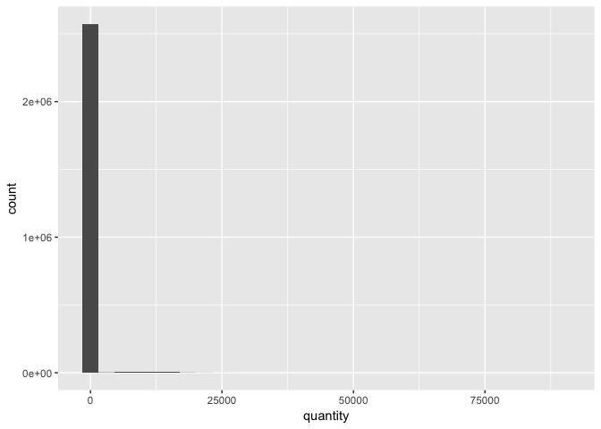
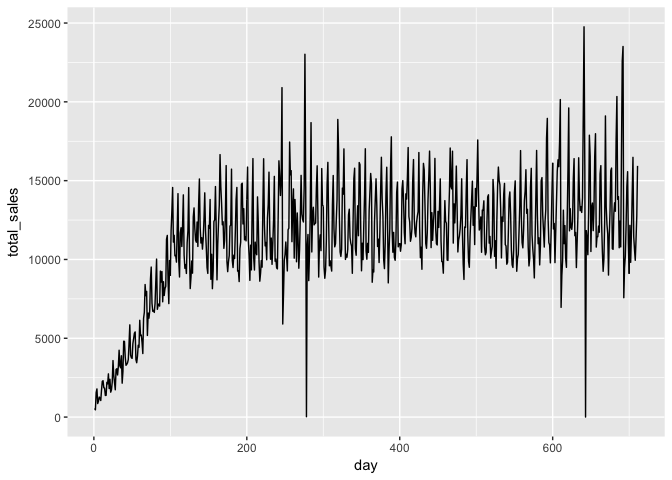
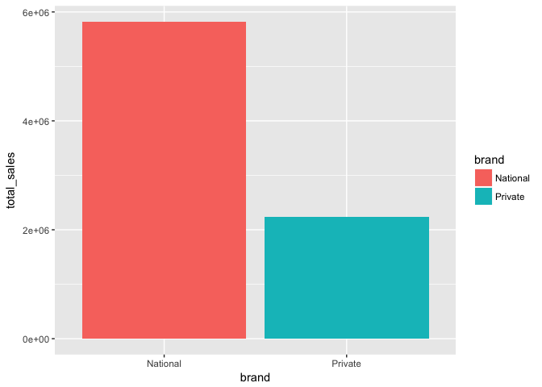
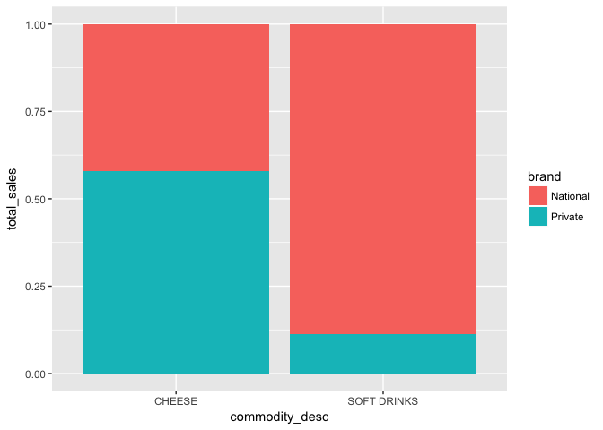
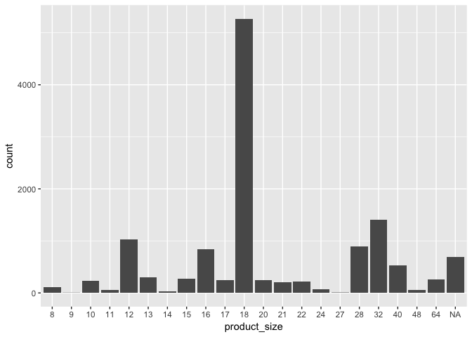

Answers to the complete jorney data visulization Exercise
================
Zoe Zheng
April 3, 2018

``` r
library(tidyverse)
```

    ## ── Attaching packages ───────────────────────────────────────────────────────────────── tidyverse 1.2.1 ──

    ## ✔ ggplot2 2.2.1     ✔ purrr   0.2.4
    ## ✔ tibble  1.4.2     ✔ dplyr   0.7.4
    ## ✔ tidyr   0.7.2     ✔ stringr 1.3.0
    ## ✔ readr   1.1.1     ✔ forcats 0.2.0

    ## ── Conflicts ──────────────────────────────────────────────────────────────────── tidyverse_conflicts() ──
    ## ✖ dplyr::filter() masks stats::filter()
    ## ✖ dplyr::lag()    masks stats::lag()

``` r
library(completejourney)
library(ggplot2)
```

**Question 1**: Create a histogram of quantity. Is there anything unusual in the graph?

``` r
ggplot(transaction_data,aes(quantity)) + geom_histogram()
```

    ## `stat_bin()` using `bins = 30`. Pick better value with `binwidth`.



The problem for this graph is that there are lots of records that have quantity of 0, so the graph is extremely concentrated on 0. **Question 2**: Create a line chart that plots total sales value over time. Is there anything unusual in the graph?

``` r
transaction_data %>% 
  group_by(day) %>% 
  summarise(total_sales=sum(sales_value)) %>% 
  ggplot() + geom_line(aes(day,total_sales))
```



The difference of total sales between 0-100 day and 100-700 day is huge. And there are several days that has 0 total sales value. **Question 3**: Create a bar chart comparing total sales value of private label versus national brands. Assign different colors to the bars using the `fill` argument inside `aes()`.

``` r
new_transaction_data <- left_join(transaction_data, product, by='product_id')

new_transaction_data%>% 
  group_by(brand) %>% 
  summarise(total_sales=sum(sales_value)) %>% 
  ggplot() + geom_bar(mapping = aes(x = brand,y = total_sales,fill = brand),stat = 'identity')
```



**Question 4**: Building upon Question 3, we suspect customers prefer national brands for soft drinks, but less so for diary products like cheese. Confirm this by creating a stacked bar chart showing the split of cheese sales between national and private brands and a similar split for soft drinks.

``` r
t_data<-new_transaction_data %>% 
  filter(commodity_desc %in% c('SOFT DRINKS','CHEESE')) %>% 
  group_by(commodity_desc,brand) %>% 
  summarise(total_sales=sum(sales_value)) 

ggplot(t_data) + geom_bar(mapping = aes(x = commodity_desc, y = total_sales, fill = brand), stat = 'identity', position = 'fill')
```



**Question 5**: Below is a block of code that creates a dataset of transactions of peanut better, jelly and jams with the product size determined in ounces. Use the `pb_and_j_data` dataset to create a bar plot that shows the most popular size (in ounces) of peanut butter and jelly products.

``` r
my_transaction_data <- left_join(transaction_data, product, by='product_id')
pb_and_j_data <- my_transaction_data %>% 
  filter(commodity_desc == 'PNT BTR/JELLY/JAMS') %>%
  select(curr_size_of_product) %>%
  mutate(product_size = as.factor(as.integer(gsub('([0-9]+)([[:space:]]*OZ)','\\1', curr_size_of_product))))
```

    ## Warning in is.factor(x): NAs introduced by coercion

``` r
ggplot(pb_and_j_data) + geom_bar(mapping = aes(product_size))
```


